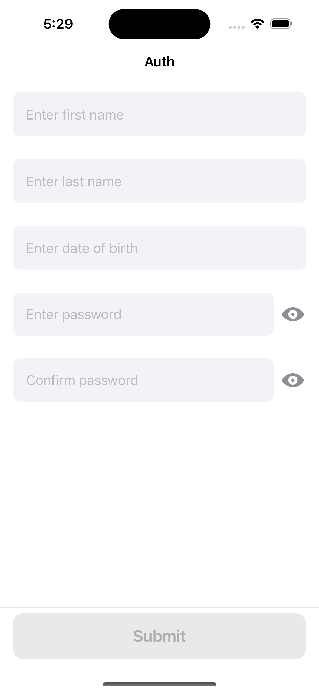

# About

Test task for the iOS platform to the shift lab.

## API documentation

More details can be found [here](https://kontests.net/api).

## Stack technology

* [SPM](https://github.com/apple/swift-package-manager)
* [Snapkit](https://github.com/SnapKit/SnapKit)
* [Alamofire](https://github.com/Alamofire/Alamofire)
* [Veil](https://github.com/DanielCardonaRojas/Veil)
* MVP
* DI Container

## Project specific

To generate `*.xcodeproj`-file use command `make generate`.  
To generate and open immediately use command `make generate open`.

If a warning is displayed `"xcodegen" cannot be opened because the developer cannot be verified.`, follow [this](https://support.apple.com/en-us/guide/mac-help/mh40616/mac) documentation.

## Preview

https://github.com/alexkamanin/ios-shiftlab-test/assets/51982941/b87a6bee-12e4-4ccf-8949-8c553b4dbabe

|  | .png) | .png) | .png) | .png) | .png) | .png) |
|---|---|---|---|---|---|---|
